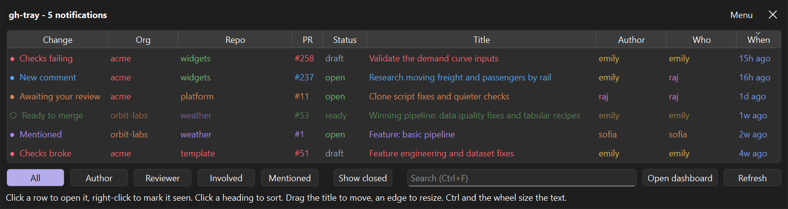

# gh-tray

A system tray icon that watches your GitHub pull requests, tells you when something changes, and opens a terminal
dashboard when you want the full picture.



## Quickstart

Run it straight from GitHub, nothing cloned and nothing installed:

```bash
uvx --from git+https://github.com/SamRWest/gh-tray gh-tray
```

Or install it as a tool, which puts `gh-tray` on your path:

```bash
uv tool install git+https://github.com/SamRWest/gh-tray
```

Either way you need [uv](https://docs.astral.sh/uv/) and the signed-in GitHub CLI; the [Requirements](#requirements)
section has the details, and `gh-tray setup` checks them for you.

The icon carries a count of changes you have not seen yet.

| Doing this to the icon | Gets you                                                                   |
| ---------------------- | -------------------------------------------------------------------------- |
| Hovering               | A short status summary                                                     |
| Clicking once          | Shows or hides the changes window, listing the most recent changes         |
| Right-clicking         | The review queue, the login-start switch, the settings window and the rest |
| Middle-clicking        | The same menu, for a desktop that keeps the right click to itself          |

The dashboard opens from the menu, or from **Open dashboard** in the changes window itself. The same menu hangs off the
**Menu** button in the window's title strip, which matters on GNOME: its indicator reports a left click on the icon only
when the icon carries no menu of its own, and reports a right click not at all, so the icon carries none and the window
is where the menu is found there, as is a middle click on the icon, which shows the menu too.

The window itself appears straight away. It is built once, when the tray starts, in the same process as the tray itself,
and hidden rather than closed afterwards, so showing it again costs nothing. Clicking the icon while it is up puts it
away again, rather than opening a second one.

The changes window lists what changed since you last looked, then what is merely waiting on you. Changes alone would
leave it saying "nothing" on a quiet day while three reviews sat in the queue.

| Column | Holds                                                                    |
| ------ | ------------------------------------------------------------------------ |
| Change | What happened, or how it stands: "Checks broke", "Awaiting your review"  |
| Org    | Who owns the repository                                                  |
| Repo   | The repository it is in                                                  |
| PR     | The pull request number                                                  |
| Status | How it stands right now: open, draft, ready, conflict, merged, or closed |
| Title  | The pull request's title                                                 |
| Author | Whose pull request it is                                                 |
| Who    | Whoever triggered the change: the reviewer, the committer, the commenter |
| When   | How long ago                                                             |

Type in the search box along the bottom, or press Ctrl+F to get there, and only rows with that text somewhere in a
column stay: a name, a repository, a status, a word of a title. Escape clears the box.

The two name columns are different questions: a comment on Emily's pull request from someone else shows Emily as the
author and the commenter as who. Filters along the bottom cut the list to one of your hats: pull requests you wrote,
ones you review, ones you are involved in some other way, or mentions of you.

Rows about merged or closed pull requests start hidden: they are done, and the window is a list of what is not. **Show
closed** along the bottom brings them back, each on a wash of its status colour, violet for merged and red for closed,
so what is finished reads as finished at a glance. The status is blank on a row about something no longer polled, which
reads as nothing rather than as a guess, and such a row is never hidden.

The windows are drawn in the desktop's own colours, and follow it live between light and dark; the settings can insist
on dark or light instead. The row inks (what a row is, who, how old and status) are the only colours the application
chooses.

Click a row to open it on GitHub. Right-click it to mark it seen, and right-click again to mark it unseen. Nothing else
marks a row: a row you have marked comes back unmarked if anything happens to it afterwards, since marking means "I have
read this", not "stop telling me about this pull request". **Mark all seen** in the tray menu clears the lot.

Each row keeps the colour of what it is: red when something is blocking, amber when it is worth a look, green when it is
good news such as a pull request that could be merged. A row you have seen is dimmed and its mark goes hollow, and
nothing else dims it. Age has a scale of its own in the date column, running from blue for just-happened, through
violet, to red for long-forgotten. Names have a colour of their own too, dealt once and kept, so the same person reads
as the same colour in every row and every showing, and so do organisations and repositories: every row from the same
organisation, or about the same repository, reads in the same colour and groups by eye.

A conflict names the pull request's author, whose branch has to take the rebase: the conflict itself is a consequence of
somebody else's merge into the base branch, and GitHub does not record whose. Who is blank only where nobody can be
found at all, such as a mention whose comment has since been deleted.

These are the states counted as waiting on you: a pull request in your review queue, one of yours where a reviewer asked
for changes, one of yours whose checks are failing, and one of yours that could be merged as it stands.

One row per pull request: three comments on the same one are one thing to look at, not three. Changes you caused
yourself are left out, since your own comment is not news to you, though your own commit breaking the checks still is.
**Refresh** asks the tray to look again, since it is the only thing allowed to poll.

Newest is at the top. Click a column heading to sort by it and again to turn the order around. It lists 20 rows by
default, which is a setting, and the rest scroll. Drag a divider in the headings to resize a column. The window has no
frame: drag its title strip to move it and any edge or corner to resize it, which the desktop does as it would for any
window. Press Escape, click the close mark, click the tray icon again, or click anything else on screen to put it away.

A width you drag, of the window or of a column, is kept across showings and restarts, in characters of the text rather
than in pixels. Ctrl and the mouse wheel make the text larger or smaller in every window at once, and Ctrl+0 puts it
back; that too is kept, and the widths follow it. The height always follows the rows: snug around a few, and no more
than its ceiling over many, with the rest scrolling. When a filter changes how many rows there are, the height changes
from the top edge, the bottom staying where it sits just above the taskbar, so new rows never slide off the bottom of
the screen.

## What counts as a change

Only transitions raise a notification, never standing state. A pull request that was already failing when the last poll
ran is not reported again, so a large backlog of red pull requests does not become a wall of notifications.

| Change            | Meaning                                                                  | Notified by default |
| ----------------- | ------------------------------------------------------------------------ | ------------------- |
| Review requested  | A pull request joined your review queue                                  | yes                 |
| Checks broke      | One of yours went from passing to failing                                | yes                 |
| Changes requested | A reviewer asked for changes on one of yours                             | yes                 |
| Mentioned         | Someone mentioned you or a team you belong to                            | yes                 |
| Ready to merge    | Approved, passing, conflict free and not a draft                         | yes                 |
| Conflict appeared | One of yours now needs a rebase                                          | no                  |
| New comment       | Someone commented on one of yours, or answered a review comment of yours | no                  |

The icon is red when an unread change is blocking someone or something of yours is broken, amber for anything else
unread, green when there is nothing to look at, and grey when the last poll failed.

Notifications are collapsed into one per poll. Clicking one opens the pull request it is about in your default browser,
and where it covers several changes, the one listed first.

## Requirements

- [uv](https://docs.astral.sh/uv/), which fetches Python and the dependencies
- [GitHub CLI](https://cli.github.com/) (`gh`), signed in
- [gh-dash](https://github.com/dlvhdr/gh-dash) for the dashboard

Nothing else: no shell, and no command line tools beyond the GitHub one. The application never handles a token of its
own. It borrows whatever you have already signed in with, and stops working the moment you sign out.

On Linux the tray icon is shown through the StatusNotifierItem protocol, which KDE, Xfce and other desktops provide
directly and GNOME provides through its AppIndicator extension. The toolkit also wants a few of the desktop's own
libraries, of which `libxcb-cursor0` is the one most often missing (the package name on Debian and Ubuntu).

On macOS, Notification Center takes notifications only from an application bundle, which a Python interpreter is not, so
they are spoken through the scripting bridge instead: the same words, without the icon, and clicking one opens nothing.

To see where you stand and install what is missing:

```bash
uv run gh-tray setup
```

Each requirement is listed with a light: 🟢 present, 🟡 missing but installable from here, 🔴 missing and needing you. Only
installs that manage their own elevation are ever run, meaning a package manager that asks for administrator rights
itself, or a GitHub extension that lands in your own directory. Anything needing a root shell is printed for you to run,
because a desktop application quietly acquiring root is not a thing anyone should have to trust. Signing in is never
done for you either, since that means entering credentials.

Starting the tray from a terminal with something missing offers the same thing before it starts. Starting it from a
login entry, where there is nobody to ask, it says what is missing and stops rather than showing an icon that could
never report anything.

## Running it

Install the dependencies once:

```bash
uv sync
```

Start the tray:

```bash
uv run gh-tray
```

That starts the tray as a process of its own, says so, and returns; the tray keeps running after the terminal closes,
and **Quit** in the icon's menu stops it. To keep it attached to the terminal instead, where Ctrl+C stops it and its log
is written to the console as well:

```bash
uv run gh-tray --foreground
```

Add `--verbose` to see everything it does, down to each click on the icon and each search it sends; the log file always
holds that level. To find out why the table is empty, poll once and read the result:

```bash
uv run gh-tray once --verbose
```

Poll once and print the result, without the tray. This is the quickest way to check the collector and the sign-in:

```bash
uv run gh-tray once
```

Open the settings window on its own:

```bash
uv run gh-tray settings
```

Only one of these can poll at a time. A second tray, or `once` while the tray is running, exits immediately rather than
polling twice. Both would compare against the same stored starting point, so whichever ran first would consume the
changes and the other would never report them. Use the tray's **Refresh now** entry instead.

## Starting at login

Turn on **Start at login** in the tray menu, or **Start automatically at login** in the settings window. This writes a
small launcher for your platform: a hidden-window script in the Startup folder on Windows, a desktop entry under
`~/.config/autostart` on Linux, and a launch agent under `~/Library/LaunchAgents` on macOS. Turning it off removes the
file. The launch agent also records your search path, since launchd starts things with a bare one on which a GitHub tool
installed by Homebrew is nowhere to be found.

## Settings

The settings window covers the poll interval, how old a pull request has to be before it is ignored, how many changes
the changes window lists, which changes raise a notification, which owners' repositories to watch, whether to start at
login, and the command that opens the dashboard. Leaving the dashboard command blank runs `gh dash` in whichever
terminal this platform provides.

Your own account and every organisation it belongs to are listed and on. Turn one off and pull requests and mentions in
its repositories are left out. The first switch, **Any other owner not listed here**, covers every owner not listed,
such as a repository you contribute to from outside your organisations; on, which it is to begin with, an organisation
you join later is watched without a visit to the settings, and off, only the owners ticked are.

**Also list** adds the pull requests you only commented on or were assigned, which is what the dashboard's Involved
section shows. It is off to begin with, so the window lists only what you wrote, what awaits your review and mentions of
you, and can show fewer pull requests than the dashboard. Being involved raises no notification of its own; a reply to a
comment of yours still does.

Settings are re-read on every poll, so a change takes effect without restarting the tray.

## Where things are kept

Settings and history live in the platform's standard application data directory, which
[platformdirs](https://pypi.org/project/platformdirs/) resolves: `%LOCALAPPDATA%\gh-tray` on Windows,
`~/.local/share/gh-tray` on Linux, `~/Library/Application Support/gh-tray` on macOS.

| File                 | Contents                                                                      |
| -------------------- | ----------------------------------------------------------------------------- |
| `config.json`        | Settings, written by the settings window                                      |
| `state.json`         | When the last collection ran, which is the window mentions are asked for      |
| `snapshot.json`      | Last poll's pull request fields, used to detect the next change               |
| `events.jsonl`       | Changes detected, kept until you have seen them and trimmed to a tail after   |
| `seen.json`          | The rows you have marked, and when you last marked everything seen            |
| `gh-tray.log`        | Rotating diagnostics                                                          |
| `last_error.log`     | Everything written when the last collection failed                            |
| `gh-tray.stderr.log` | Whatever a tray started on its own wrote to its error stream, such as a crash |
| `layout.ini`         | The window width and column widths you last dragged                           |
| `gh-tray.lock`       | Held open while the tray runs, so a second copy cannot start                  |

Polling and looking are tracked separately. The poller advances its baseline every run, but the unread count is measured
against what you have actually looked at, so nothing is lost between the moment a change lands and the moment you read
it. Right-clicking a row marks that one row; **Mark all seen** sets a single timestamp and anything older than it counts
as seen without a mark of its own.

Every state file is written to a temporary file and then moved into place. A process stopped part way through a plain
write would leave a truncated file, and a truncated state file is worse than a missing one: it reads as valid but
incomplete, so the change history it describes would be silently wrong.

## How the code is arranged

| Module               | Responsibility                                                                         |
| -------------------- | -------------------------------------------------------------------------------------- |
| `config.py`          | Settings, defaults, repair of hand-edited files, data locations                        |
| `storage.py`         | Reading state files, and writing them so a reader never sees half a file               |
| `environment.py`     | Everything platform-specific: terminals, login start, instance lock, Dock, AppleScript |
| `github.py`          | Talking to GitHub through the signed-in command line tool                              |
| `collector.py`       | Asking GitHub what is true now, and flattening the answer                              |
| `events.py`          | Detecting changes between polls, and the event history                                 |
| `service.py`         | One polling cycle: collect, diff, record, summarise                                    |
| `status.py`          | Turning a poll result into a colour, a count and hover text                            |
| `notifier.py`        | Desktop notifications and their click actions                                          |
| `toolkit.py`         | Starting the toolkit, an icon from a drawn picture, the theme setting, the text zoom   |
| `tray.py`            | The icon, its menu, and the polling timer                                              |
| `theme.py`           | The row inks, in a dark and a light set, following the desktop's theme                 |
| `popup.py`           | Which rows the changes window lists, in what order and in which inks                   |
| `window.py`          | The changes window itself and its table                                                |
| `settings_window.py` | The settings window                                                                    |

The table is the toolkit's own, coloured cell by cell.

Notifications run on a long-lived event loop of their own. The platform backend calls back into the sending loop when a
notification is clicked, which can happen long after the send returns, so a loop closed straight after sending would
raise on that callback and no click could ever be handled.

## The collector

One poll makes three searches, one for your open pull requests, one for those awaiting your review and one for recently
closed pull requests you had a hand in, a fourth for everything else open you are involved in when the settings ask for
it, and one read of the notifications feed. The closed search raises nothing: it is there so a row can say its pull
request is merged or closed rather than guessing. It covers only the last 30 days, whatever the age cutoff is set to,
and asks for newest first, so the search's page cap only ever drops the oldest results rather than something that closed
this morning. Each search asks for the state of every pull request along with the last commit's author, the most recent
review's author and the most recent comment's author, since those are what name the person behind a change. The
notifications feed identifies a mention only by the comment it points at, so the first few of those are looked up one at
a time.

Collecting knows nothing about what was true last time: it reports only what is true now, and comparing is somebody
else's job. That is what lets a poll fail without disturbing anything already recorded.

GitHub answers a heavy search with an error often enough that retrying is normal rather than exceptional, and an error
arrives as well-formed JSON carrying no results. A reply therefore counts as usable only once it actually holds results,
and each page is retried three times before the collection gives up.

The same unreliability is why a pull request missing from a single result is held for a few polls before being treated
as gone: without that, one transient failure would report everything that came back as newly arrived.

## Development

Set the project up, which installs the dependencies and the pre-commit hooks:

```bash
uv run poe init
```

The jobs are named, and `uv run poe` on its own lists them:

| Job        | Does                                                        |
| ---------- | ----------------------------------------------------------- |
| `test`     | Runs the tests                                              |
| `ty`       | Runs the type checks                                        |
| `ty_all`   | Runs the type checks as Windows, macOS and Linux in turn    |
| `lint`     | Runs the pre-commit checks on staged files                  |
| `lint_all` | Runs them on every file, staged or not                      |
| `run`      | Starts the tray                                             |
| `once`     | Polls a single time and prints the result, without the tray |

The checks are formatting and linting with [ruff](https://docs.astral.sh/ruff/), type checking with
[ty](https://github.com/astral-sh/ty), a workflow linter, a scan of the dependencies for known vulnerabilities, and the
usual file hygiene. Ruff's security rules are on, which is the same set [bandit](https://bandit.readthedocs.io/)
implements, so bandit is not installed separately.

Every push runs the tests on Linux, Windows and macOS and the checks once, in the **Checks and tests** workflow. Windows
is where the awkward parts live: locking against a second copy and starting a window with no console. Linux and macOS
are checked because the tray, the login entry, the terminal launcher and the notifier each take a path of their own
there. The type checks also run once as each platform, which hides what that platform lacks, so a Windows-only call
outside its guard fails in the workflow rather than on somebody's Mac. The login entries are checked with each desktop's
own validator where the runner has one.

The tests drive the windows through the toolkit's offscreen platform, so no display is needed on any runner.
